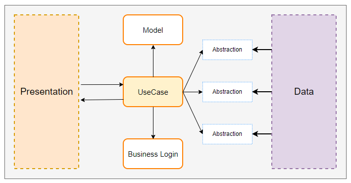
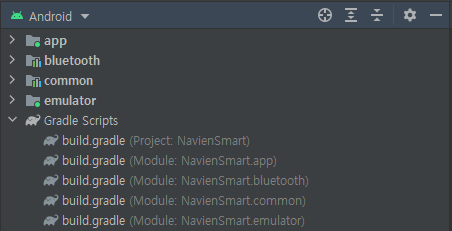

# Android Architecture Project.
## Continue to study and ponder to improve the code structure.

This project is to make template code that can be applied to any app development.
It is written based on Kotlin and Java.

- Language: Kotlin + Java
- Structure Summary
    - ✨ Presentation (XML / Activity / Fragment / Custom View / ViewModel)
    - ✨ Domain (UseCases / Entities / Repository Interface)
    - ✨ Data (Repository / Source (DB / Remote Core Module))
    - ✨ Utils

## Technology Stack
Kotlin + MVVM (Model-View-ViewModel) + Retrofit + Gson + RxJava

 

  

 

## Android Studio Project Structure
- app
- library

 

  

 

## Release Note

- 2022/11/19 : Added entire template source code.
- 2022/11/21 : (1st) Fixed build error occurred by wrong app's id (library) and gradle version.
- 2022/11/21 : (2nd) Re-arrange app / library folder hierarchy.
- 2022/12/07 : (1st) Added style1, Android template source code (legacy style)
- 2022/12/07 : (2nd) Added style2, Android template source code (legacy style)
- 2022/12/09 : Set-up gradle and manifext initial development environment. (Cannot compile)

## How To Setup Environment

It's mandantory to set up the development environment and build the app by following the instructions below:

> Visit https://developer.android.com/
> Set-up Java (JDK + JRE)
> Set JAVA / Android Path
> Install AndroidStudio
> Set-up ADB

## Source Code

Under construction

## Link

If you are interested in information about me or other activities, please access the link below.

| Plugin | LINK |
| ------ | ------ |
| Instagram | [https://www.instagram.com/aidenkoog/] |
| Github page | [https://aidenkoog.github.io/aidenkoog/] |
| Youtube | [https://www.youtube.com/channel/UC3hT_aGpXxL4Dygz4_tNVQA] |

