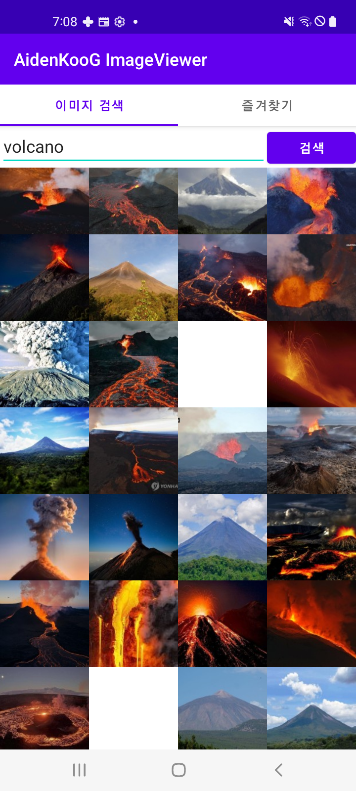

### 이미지 검색 샘플 프로젝트 (코루틴 + 플로우 활용)

#### Screenshots

  <p align="center" style="background-color: #000">
      
  </p>

#### Release Note

- 2023/07/17: Initialized coroutine flow android project source code.
- 2023/07/18: Separated ui folder hierarchy and deleted hardcoded string resources in MainActivity.
- 2023/07/18: Added comment code for source code comprehension.

#### API 세팅

[네이버 이미지 API](https://developers.naver.com/docs/search/image/)를 사용합니다.

[애플리케이션 등록](https://developers.naver.com/apps/#/register)을 하고 옵시다.

등록이 완료되면 아래와 같이 테스트해봅시다. `XXXX`와 `YYYY`는 본인의 아이디와 시크릿으로 대체하세요.

```sh
curl "https://openapi.naver.com/v1/search/image?query=%EC%A3%BC%EC%8B%9D&display=10&start=1&sort=sim" \
    -H "X-Naver-Client-Id: XXXX" \
    -H "X-Naver-Client-Secret: YYYY" -v
```

출력된 예는 아래와 같습니다.

```json
{
  "lastBuildDate": "Mon, 14 Feb 2022 05:01:40 +0900",
  "total": 3815005,
  "start": 1,
  "display": 10,
  "items": [
    {
      "title": "돌아온 채권-주식 상관관계…연말 수급장 영향",
      "link": "http://imgnews.naver.net/image/5227/2021/12/21/0000462901_001_20211221121803151.jpg",
      "thumbnail": "https://search.pstatic.net/common/?src=http://imgnews.naver.net/image/5227/2021/12/21/0000462901_001_20211221121803151.jpg&type=b150",
      "sizeheight": "313",
      "sizewidth": "500"
    },
    {
      "title": "[주식투자KR] KOSDAQ 예상 지수2021.12.11(토) — Steemit",
      "link": "https://i.imgur.com/FEadgZe.png",
      "thumbnail": "https://search.pstatic.net/sunny/?src=https://i.imgur.com/FEadgZe.png&type=b150",
      "sizeheight": "750",
      "sizewidth": "1500"
    }
  ]
}
```

### 인증 헤더 수정

`data/NaverImageSearchRepository.kt`를 아래의 내용으로 수정합니다.

```kotlin
val client = OkHttpClient.Builder()
    .addInterceptor { chain ->
        val request = chain.request().newBuilder()
            .addHeader("X-Naver-Client-Id", "XXXX")
            .addHeader("X-Naver-Client-Secret", "YYYY")
            .build()
        chain.proceed(request)
    }
```

다시 말하지만 `XXXX`와 `YYYY`는 자신이 사용하는 아이디와 시크릿으로 수정해야 합니다.

### JSON에 맞추어 Item 데이터 클래스 수정

`model/Item.kt`의 데이터 클래스 `Item`을 수정합시다.

```kotlin
data class Item(
    val title: String,
    val link: String,
    val thumbnail: String,
    @SerializedName("sizeheight") val sizeHeight: Int,
    @SerializedName("sizewidth") val sizeWidth: Int
)
```

서버에서 제공하는 JSON의 필드 이름이 일관되지 않기 때문입니다.

### 데이터 소스에서 Retrofit 호출

`data/NaverImageSearchDataSource.kt`의 `NaverImageSearchDataSource.load` 내용을 다음과 같이 수정합니다.

```kotlin
override suspend fun load(params: LoadParams<Int>): LoadResult<Int, Item> {
    val start = params.key ?: defaultStart

    return try {
        val response = imageSearchService.getImages(query, params.loadSize, start)

        val items = response.items
        val nextKey = if (items.isEmpty()) {
            null
        } else {
            start + params.loadSize
        }
        val prevKey = if (start == defaultStart) {
            null
        } else {
            start - defaultDisplay
        }
        LoadResult.Page(items, prevKey, nextKey)
    } catch (exception: Exception) {
        LoadResult.Error(exception)
    }
}
```

`val response = imageSearchService.getImages(query, params.loadSize, start)` 한줄이 추가된 것입니다.

### 검색 버튼 리스너 등록

`ui/main/ImageSearchFragment.kt`의 `ImageSearchFragment.onCreateView`에서 아래와 같이 수정합니다.

```kotlin
binding.search.setOnClickListener {
    val query = binding.editText.text.trim().toString()
    imageSearchViewModel.handleQuery(query)
}
```

### 뷰 홀더 구현

이제 `ui/main/ViewHolder.kt`의 `ImageSearchViewHolder`의 `bind` 메서드를 구현해봅시다. (파일 이름은 일관성 없게 명명되었는데 여기에서는
넘어갈게요.)

```kotlin
fun bind(item: Item?) {
    item?.let { item ->
        Glide.with(binding.root)
            .load(item.thumbnail)
            .centerCrop()
            .into(binding.imageView)
        binding.imageView.setOnClickListener {
            like.invoke(item)
        }
    }
}
```

이미지를 `Glide`를 이용해 불러오고 클릭했을 때 `like` 람다가 수행되도록 하였습니다.

### 어댑터의 DiffUtil.ItemCallback 구현

`ui/main/ImageSearchAdapter.kt`의 `ImageSearchAdapter`의 컴패니언 오브젝트를 다음과 같이 수정합니다.

```kotlin
companion object {
    val comparator = object : DiffUtil.ItemCallback<Item>() {
        override fun areItemsTheSame(oldItem: Item, newItem: Item): Boolean {
            return oldItem.thumbnail == newItem.thumbnail
        }

        override fun areContentsTheSame(oldItem: Item, newItem: Item): Boolean {
            return oldItem == newItem
        }

    }
}
```

`areItemsTheSame`이 먼저 호출되고 그 다음으로 `areContentsTheSame`가 호출되기 때문에 `areItemsTheSame`이 항상 좀더 좁은 범위에서
체크를 해야합니다.

일반적으로는 유니크한 키등을
`areItemsTheSame`에서 체크하는데 여기에서는 마땅한 것이 없기 때문에 썸네일 주소로 체크하겠습니다. `areContentsTheSame`은 내용이 바뀐 것이 없나
체크하는데 그냥 `==`으로 비교하면 값을 전부 비교합니다.

### 섹션 페이저 어댑터 구현

`ui/main/SectionsPagerAdapter.kt`에 있는 `SectionsPagerAdapter`을 구현합시다.

```kotlin
class SectionsPagerAdapter(private val fragmentActivity: FragmentActivity) :
    FragmentStateAdapter(fragmentActivity) {
    override fun createFragment(position: Int): Fragment =
        ImageSearchFragment()

    override fun getItemCount(): Int = 2
}
```

일단 `ImageSearchFragment`만 사용하게 두었습니다.

생성은 `createFragment`에서 직접 하는 것을 추천합니다. 프레임워크가 필요에 따라 생성하고 관리하게 하는 것이 많은 경우에 적절합니다.

### ImageSearchFragment의 어댑터 연동과 리사이클러 뷰 세팅

`ImageSearchFragment`의 `onCreate`와 `onCreateView`를 아래와 같이 수정합니다.

```kotlin
override fun onCreate(savedInstanceState: Bundle?) {
    super.onCreate(savedInstanceState)
    imageSearchViewModel = ViewModelProvider(requireActivity())[ImageSearchViewModel::class.java]
}

override fun onCreateView(
    inflater: LayoutInflater, container: ViewGroup?,
    savedInstanceState: Bundle?
): View {

    val binding = FragmentMainBinding.inflate(inflater, container, false)
    val root = binding.root

    viewLifecycleOwner.lifecycleScope.launch {
        imageSearchViewModel.pagingDataFlow
            .collectLatest { items ->
                adapter.submitData(items)
            }
    }

    binding.recyclerView.adapter = adapter
    binding.recyclerView.layoutManager = GridLayoutManager(context, 4)
    binding.search.setOnClickListener {
        val query = binding.editText.text.trim().toString()
        imageSearchViewModel.handleQuery(query)
    }

    return root
}
```

뷰 라이프사이클에 의존적인 코드 블록을 `onCreateView`에 옮겼고, 리사이클러 뷰 세팅, 서치 버튼 세팅등을 넣어두었습니다.

`MainActivity`의 TabLayoutMediator 코드를 아래와 같이 바꿔봅시다.

```kotlin
TabLayoutMediator(tabs, viewPager) { tab, position ->
    tab.text = if (position == 0) {
        "이미지 검색"
    } else {
        "즐겨찾기"
    }
```

### 즐겨 찾기 구현

이제 즐겨찾기 기능을 구현해봅시다.

레이아웃을 구현합시다. `fragment_favourites.xml` 파일은 다음과 같이 구현합니다.

```xml
<?xml version="1.0" encoding="utf-8"?>
<FrameLayout xmlns:android="http://schemas.android.com/apk/res/android"
    xmlns:tools="http://schemas.android.com/tools" android:layout_width="match_parent"
    android:layout_height="match_parent" tools:context=".ui.main.FavouritesFragment">

    <androidx.recyclerview.widget.RecyclerView android:id="@+id/recyclerView"
        android:layout_width="match_parent" android:layout_height="match_parent" />

</FrameLayout>
```

`ImageSearchViewModel`에 쉐어드 플로우를 수정해 진입했을 때 좋아요 내용을 보여줄 수 있게 합니다.

```kotlin
class ImageSearchViewModel : ViewModel() {
    private val repository = NaverImageSearchRepository()
    private val queryFlow = MutableSharedFlow<String>()
    private val favorites = mutableSetOf<Item>()
    private val _favoritesFlow = MutableSharedFlow<List<Item>>(replay = 1)
```

`FavouritesAdapter`는 다음과 같이 구현해봅시다.

```kotlin
package io.github.aidenkoog.image_viewer.ui.main

import android.view.ViewGroup
import androidx.recyclerview.widget.RecyclerView
import io.github.aidenkoog.image_viewer.model.Item

class FavouritesAdapter : RecyclerView.Adapter<ImageSearchViewHolder>() {
    private var items: List<Item> = listOf()

    override fun onCreateViewHolder(parent: ViewGroup, viewType: Int): ImageSearchViewHolder {
        return ImageSearchViewHolder.create({}, parent)
    }

    override fun onBindViewHolder(holder: ImageSearchViewHolder, position: Int) {
        val item = items[position]
        holder.bind(item)
    }

    override fun getItemCount(): Int {
        return items.size
    }

    fun setItems(items: List<Item>) {
        this.items = items
        notifyDataSetChanged()
    }
}
```

`FavouritesFragment`는 아래와 같이 구현합니다.

```kotlin
package io.github.aidenkoog.image_viewer.ui.main

import android.os.Bundle
import androidx.fragment.app.Fragment
import android.view.LayoutInflater
import android.view.View
import android.view.ViewGroup
import androidx.lifecycle.ViewModelProvider
import androidx.lifecycle.lifecycleScope
import androidx.recyclerview.widget.GridLayoutManager
import kotlinx.coroutines.flow.collectLatest
import io.github.aidenkoog.image_viewer.databinding.FragmentFavouritesBinding

class FavouritesFragment : Fragment() {

    private lateinit var imageSearchViewModel: ImageSearchViewModel

    val adapter = FavouritesAdapter()

    override fun onCreate(savedInstanceState: Bundle?) {
        super.onCreate(savedInstanceState)
        imageSearchViewModel =
            ViewModelProvider(requireActivity())[ImageSearchViewModel::class.java]
    }

    override fun onCreateView(
        inflater: LayoutInflater, container: ViewGroup?,
        savedInstanceState: Bundle?
    ): View {
        val binding = FragmentFavouritesBinding.inflate(inflater, container, false)
        val root = binding.root
        binding.recyclerView.adapter = adapter
        binding.recyclerView.layoutManager = GridLayoutManager(context, 3)

        viewLifecycleOwner.lifecycleScope.launchWhenResumed {
            imageSearchViewModel.favoritesFlow.collectLatest {
                adapter.setItems(it)
            }
        }

        return root
    }

    companion object {
    }
}

```

`SectionsPagerAdapter`를 업데이트해 즐겨찾기를 사용할 수 있게 합니다.

```kotlin
class SectionsPagerAdapter(private val fragmentActivity: FragmentActivity) :
    FragmentStateAdapter(fragmentActivity) {
    override fun createFragment(position: Int): Fragment =
        if (position == 0) {
            ImageSearchFragment()
        } else {
            FavouritesFragment()
        }

    override fun getItemCount(): Int = 2
}
```