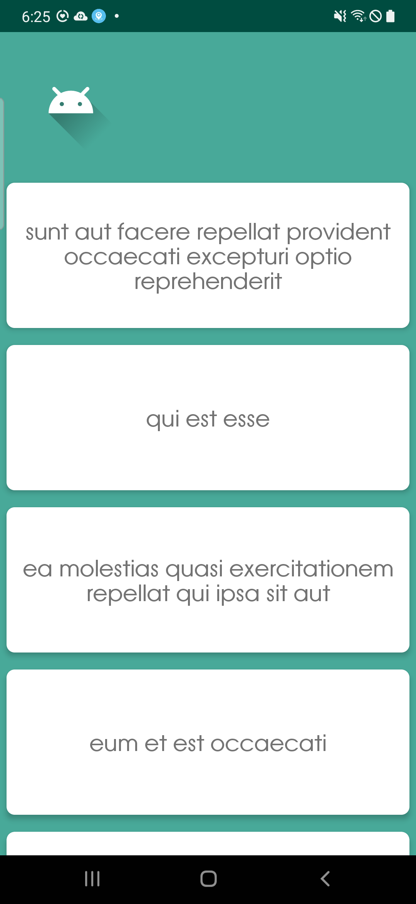

## Android Architecture Project.

#### Continue to study and ponder to improve the code structure.

This project is to make template code that can be applied to any app development.
It is written based on Kotlin.

#### Screenshots

  

      
  

#### Summary

- Language: Kotlin
- Structure Summary
    - ✨ Data
    - ✨ Di
    - ✨ Domain
    - ✨ Presentation
    - ✨ Util

#### Release Note

- 2022/09/16 ~ 2022/12/31 : Reviewed Android source code I had made.
- 2023/01/04 : Update Android template source code.
- 2023/01/05 : Updated .gitignore / Added dummy data / Rearrange fragments.
- 2023/02/22 : Increased outdated version of dependencies / Added google service json file /
  Arranged source code.
- 2023/05/01 : Added exception handler for RxJava / Added Logger setup code to MainApplication.
- 2023/05/11 : Arranged utility classes which were already implemented and Added toast utility
  functions.
- 2023/05/11 : Upgrade dependency version.
- 2023/05/11 : Created new media player project.
- 2023/05/12 : Initalized coroutine flow project. (project + activity main layout)
- 2023/05/12 : Added view binding option, main view model.
- 2023/05/13 : Added renderer class and data class for state.
- 2023/05/14 : Added mapTo function's dependency.
- 2023/05/15 : Completed stop watch project source code.
- 2023/05/15 : Changed player directory name (-> MusicPlayer) and Updated version of coroutine flow
  project.
- 2023/05/15 : Initialized player library which uses exo player library.
- 2023/05/16 : Did refactoring main app legacy module which shows user list.
- 2023/05/17 : Added screenshot images.
- 2023/05/18 : Added Ktor client project with ktor & navigation dependencies for study.
- 2023/05/18 : Added ktor client provider, data classes for request and response, test ui components
  and dummy api service interface.
- 2023/05/18 : Finished api service implementation.

#### Link

If you are interested in information about me or other activities, please access the link below.

| Plugin      | LINK                           |
| ----------- | ------------------------------ |
| Github page | [https://aidenkoog.github.io/] |
