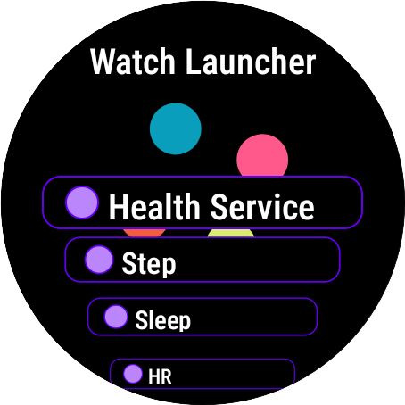
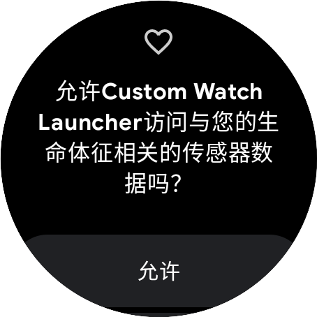
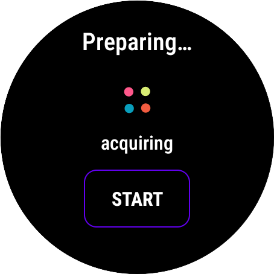
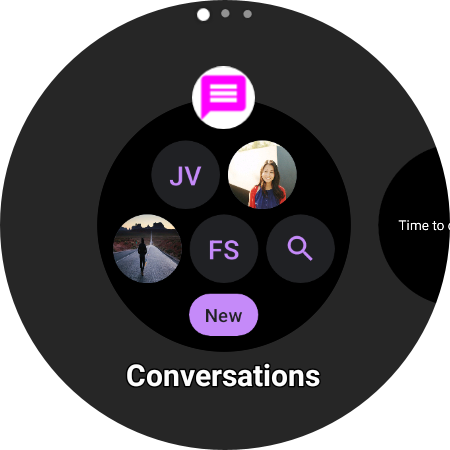

## Android Wear OS Architecture Project.

#### Continue to study and ponder to improve the code structure.

This project is to make template code that can be applied to any app development.
It is written based on Kotlin.

#### Screenshots

  

      
  

  

      
  

  

      
  

  

      
  

  

      
  

  

      
  

  

      
  

#### Summary

- Language: Kotlin
- Structure Summary
  - ✨ App
  - ✨ Data
    - ✨ Mapper
    - ✨ Repositories
    - ✨ Sources
  - ✨ Di
  - ✨ Domain
    - ✨ Model
    - ✨ Repositories
    - ✨ UseCases
  - ✨ Presentation
    - ✨ Base
    - ✨ Home
    - ✨ Intro
    - ✨ Setting
  - ✨ Services
    - ✨ Fcm
    - ✨ Health
    - ✨ Tile
    - ✨ WatchFace
  - ✨ Utils
    - ✨ Utils
    - ✨ Constants

#### Release Note

- 2023/01/05 : Initialize App source template.
- 2023/01/06 : Setup splash, login, home and setting screens.
- 2023/01/06 : Added back-key event handler to each fragment / Added icon to each item of main list.
- 2023/01/09 : Modified to go back to the home screen when pressing the back key on the setting
  screen / Added color icon to home main list item.
- 2023/01/09 : Added health related screens.
- 2023/01/09 : Added hidden mode navigation / Added long click event handler.
- 2023/01/09 : Added Hilt setup to view models.
- 2023/01/09 : Added Health service & UI (Draft 1 - Splash > Auth > Home > Health Service)
- 2023/01/10 : Added Watch face service.
- 2023/01/10 : Added Watch tile service. (SuspendingTileService, Compose UI)
- 2023/01/10 : Added Firebase modules / Fixed issue that crash occurs when back to home from health
  service screen / Added time format util / Added android unit test folder hierarchy.
- 2023/01/10 : Added Open source license gathering module & UI.
- 2023/01/10 : Fixed build error caused by firebase modules / issue that license ui is not shown in
  home list.
- 2023/01/11 : Added RxSocketClient / Added test code to connect to server socket / Added SOS ui.
- 2023/02/22 : Increased outdated version of dependencies.
- 2023/05/16 : Updated up-to-date dependencies.
- 2023/05/17 : Added screenshot images.

#### Link

If you are interested in information about me or other activities, please access the link below.

| Plugin      | LINK                           |
| ----------- | ------------------------------ |
| Github page | [https://aidenkoog.github.io/] |
