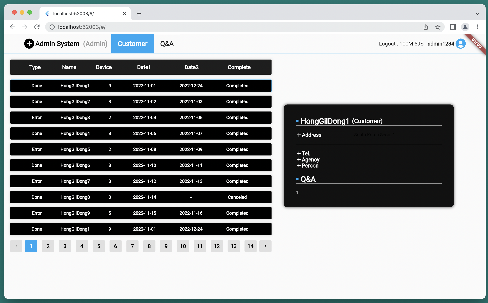

### Flutter Web & Desktop Admin Page

#### Screenshot

- Main Screen (Web & MacOS)
  <p align="center" style="background-color: #000">
    
  </p>

#### Summary

- Admin Web page
- Language: Dart
- Structure Summary
  - ✨ controller
  - ✨ data
  - ✨ model
  - ✨ number_paginator
    - ✨ model
    - ✨ ui
  - ✨ screens
    - ✨ responsive
    - ✨ widget

#### Release Note

- 2023/05/17 : Initialize Flutter admin website project.
- 2023/05/17 : Changed entire webpage theme.

#### How To Setup Environment Before Developing App

It's mandantory to set up the development environment and build the app by following the instructions below:

- Visit https://docs.flutter.dev/development/tools/sdk/releases?tab=macos
- Download the latest flutter of stable channel.
- Execute export PATH="\$PATH:`pwd`/flutter/bin" on console or Modify bash_profile.
- flutter precache
- flutter doctor
- if you encounter this error ---> Flutter - Unable to find bundled Java version.
- cd /Applications/Android\ Studio.app/Contents/jre
- [Not Electric Eel] ln -s ../jre jdk
- [Not Electric Eel] ln -s "/Library/Internet Plug-Ins/JavaAppletPlugin.plugin" jdk
- [Electric Eel] cd /Applications/Android\ Studio.app/Contents
- [Electric Eel] ln -s jbr jre
- flutter doctor
- flutter run

#### How To Build Environment

- Flutter channel
  - master
  - beta
  - stable
  - dev

```
 # Web
 $ flutter channel beta
 $ flutter upgrade
 $ flutter config --enable-web
 $ flutter packages pub global activate webdev
 $ flutter packages upgrade
 $ flutter create --platforms=web .
 $ flutter run -d chrome
 #
 # Desktop (macOS)
 $ flutter channel dev
 $ flutter upgrade
 $ flutter config --enable-macos-desktop # for macOS
 $ flutter create --platforms=macos .
 # you need to install Xcode or VisualStudio or gcc toolchains.
 $ flutter run -d macos # for macOS
 #
 # Desktop (Windows)
 $ flutter channel dev
 $ flutter upgrade
 $ flutter config --enable-windows-desktop # for windows
 $ flutter create --platforms=windows .
 # you need to install Xcode or VisualStudio or gcc toolchains.
 $ flutter run -d windows # for windows
```

#### Link

If you are interested in information about me or other activities, please access the link below.

| Plugin      | LINK                           |
| ----------- | ------------------------------ |
| Github page | [https://aidenkoog.github.io/] |
