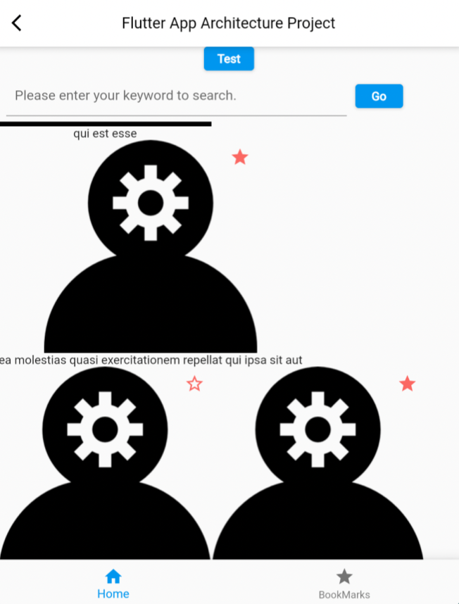

### Flutter App GetX Architecture

- API: https://jsonplaceholder.typicode.com/posts

#### Screenshot

- Main Screen (Web & Mobile)
  

      
  

#### How to execute Flutter web, iOS and Android mobile app

- flutter pub get
- Web
  - flutter run -d chrome
- iOS
  - flutter emulators --launch apple_ios_simulator
  - flutter run
- Android
  - Run emulator in AndroidStudio
  - flutter run

#### Project Package Structure

- ✨ assets
  - ✨ strings
- ✨ controllers
  - ✨ api
- ✨ models
- ✨ presentation
  - ✨ page
    - ✨ bookmark
    - ✨ home
    - ✨ splash
  - ✨ widgets
    - ✨ button
    - ✨ snackbar
- ✨ utils

#### Commit History

- 2023/05/05: Added README template.
- 2023/05/06: Created new flutter project.
- 2023/05/06: Designed the entire source package structure (Draft 1)
- 2023/05/06: Added splash page with logo image and title.
- 2023/05/06: Added meta and image data model.
- 2023/05/06: Designed the entire structure (Draft 2) / Added splash, home, favorite and detail UI, functions.
- 2023/05/10: Added template function to add getx controller and code which initializes GetStorage.
- 2023/05/11: Renewed Flutter mobile app project source code.
- 2023/05/11: Fixed dependency issue.
- 2023/05/11: Added test code which can test scroll direction events of list view.
- 2023/05/11: Updated test animation code executed when page is scrolled.

#### Link

If you are interested in information about me or other activities, please access the link below.

| Plugin        | LINK                                                   |
| ------------- | ------------------------------------------------------ |
| Website       | [https://aidenkoog.github.io/]                         |
| GitHub        | [https://github.com/aidenkoog]                         |
| Flutter Study | [https://github.com/aidenkoog/til/tree/master/flutter] |
