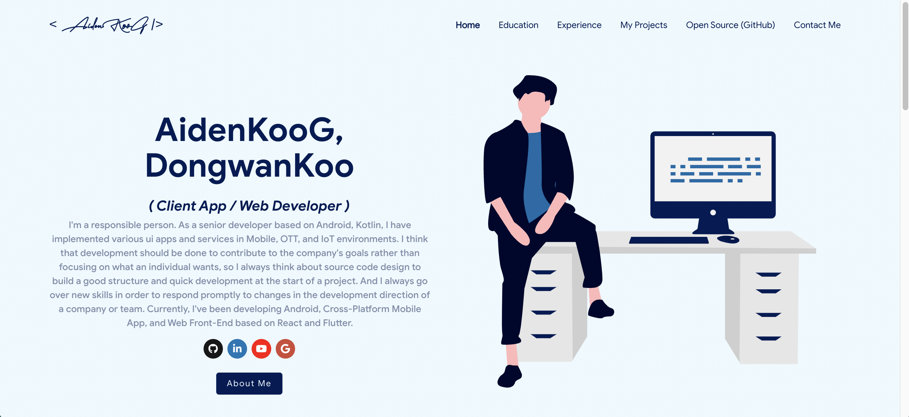
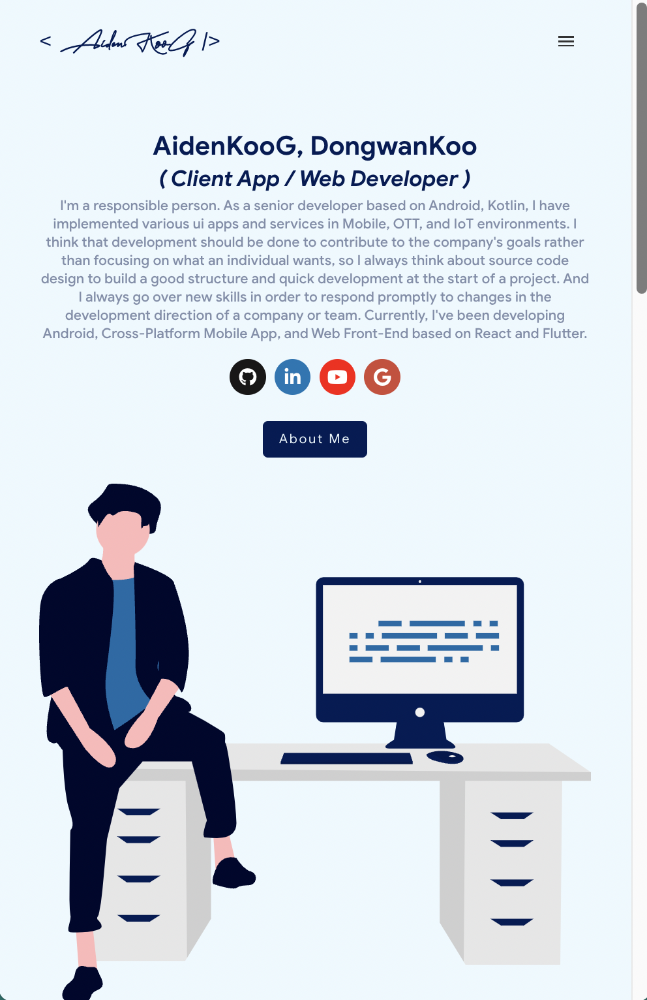

## React.js My Portfolio Web Page

#### Screenshot

- Main Screen
  

      
  

  

      
  

#### Summary

This project shows data using the NAVER Map API.
It is written based on JavaScript.

- Language: Javascript
- Library: React (A library for creating user interfaces.)
- Structure Summary
  - ✨ asset
  - ✨ data
  - ✨ domain
  - ✨ utils
  - ✨ assets

#### Release Note

- 2023/02/14: Deleted previous source code / Added meta code.
- 2023/02/14: (2nd) Initialize project (HEAD + related files)
- 2023/02/15: (1st) Added navbar + items / Added template homepage sections.(empty)
- 2023/02/15: (2nd) Added home section items (profile, introduction messages)
- 2023/02/15: (3rd) Added section named 'about me'.
- 2023/02/15: (4th) Added my skillset information.
- 2023/02/15: (5th) Added work related information.
- 2023/02/15: (6th) Added testimonials section.
- 2023/02/15: (7th) Added contact point section.
- 2023/02/15: (8th) Changed etc skills section.
- 2023/02/15: (9th) Added global style css setup.
- 2023/02/15: (10th) Added CSS typography.
- 2023/02/15: (11th) Applied navigation bar css.
- 2023/02/15: (12th) Applied home CSS style.
- 2023/02/16: (1st) Added about-me section's CSS style.
- 2023/02/16: (2nd) Added skill-set section's CSS style.
- 2023/02/16: (3rd) Added work project section's CSS style.
- 2023/02/16: (4th) Added award & testimonials section's CSS style.
- 2023/02/16: (5th) Added contact section's CSS style.
- 2023/02/16: (6th) Customized work items / hover effect.
- 2023/02/21: Applied media query for various screen.
- 2023/02/22: (1st) Changed main logo image.
- 2023/02/22: (2nd) Fix window scrollY mistake (scrollY() --> scrollY)
- 2023/02/22: (3rd) Applied dynamic effect to navigation bar.
- 2023/02/22: (4th) Added logic to navigate to the corresponding section when a navigation bar item is clicked.
- 2023/02/22: (5th) Added logic to navigate to contact section when contact button on home section is pressed.
- 2023/02/22: (6th) Added logic to make home contents transparent when page is scrolled from top of page.
- 2023/02/22: (7th) Added arrow up button.
- 2023/02/24: Added animation occurred when pressing project / Added project tab click event.
- 2023/02/24 : Deleted static active option.
- 2023/02/24 : Applied media query for small screen size to navigation bar.
- 2023/02/24 : Updated entire component's attributes.
- 2023/02/24 : Fixed navigation html errors.
- 2023/02/24 : Fixed project's count icon position issue. / Changed background image.
- 2023/02/24 : Changed work related contents.
- 2023/02/24 : Set top margin of section (Not corresponding to mobile screen)
- 2023/02/24 : Update my skills content.
- 2023/02/24 : Applied dynamic selection about navigation bar.
- 2023/03/11 : Added another styled home page source files.
- 2023/03/11 : Deleted macOS related files (unused files) / Added .gitignore.
- 2023/04/26 : Updated portfolio webpage content / files
- 2023/04/29 : Updated resume links
- 2023/05/02 : Added new project links
- 2023/05/17 : Converted to React from Vanila Js.

#### How To Setup Environment

It's mandantory to set up the development environment and build the app by following the instructions below:

> Visit https://ko.reactjs.org/
> npx create-react-app reactjs
> npm start

#### Link

If you are interested in information about me or other activities, please access the link below.

| Plugin      | LINK                           |
| ----------- | ------------------------------ |
| Github page | [https://aidenkoog.github.io/] |
